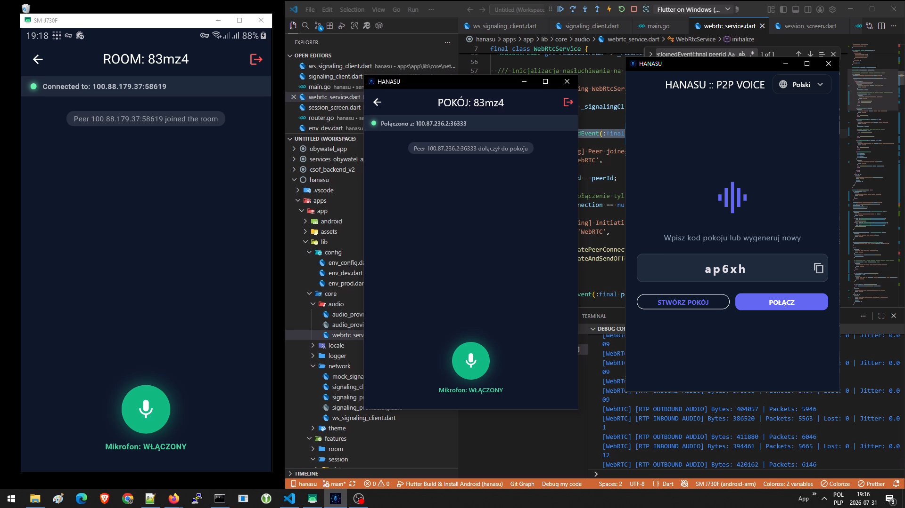

# Hanasu

A real-time speech translation system operating over a P2P / Tailscale network using the Sherpa-ONNX speech synthesis engine.

## Project Structure

- `apps/` – Client applications (Flutter).
- `services/backend/` – Broker service & API (handles PIN-protected rooms and translation management).
- `services/tts-engine/` – Dockerized Sherpa-ONNX speech synthesis engine.
- `data/` – Local models and output storage (ignored by Git).

### Prerequisites

- Docker & Docker Compose
- Flutter SDK (for client apps)

## Interface WIP

  

